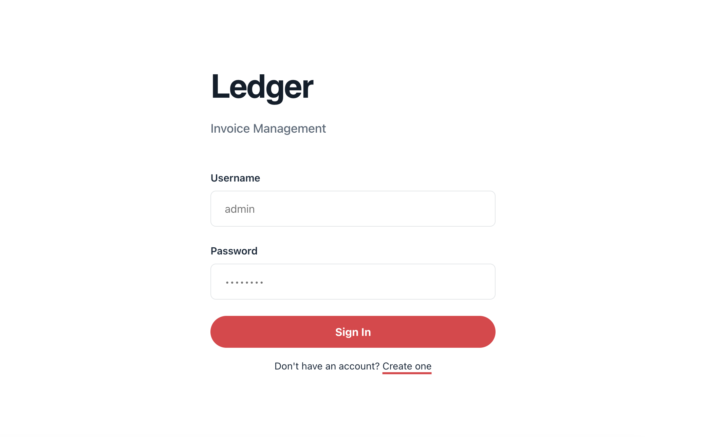
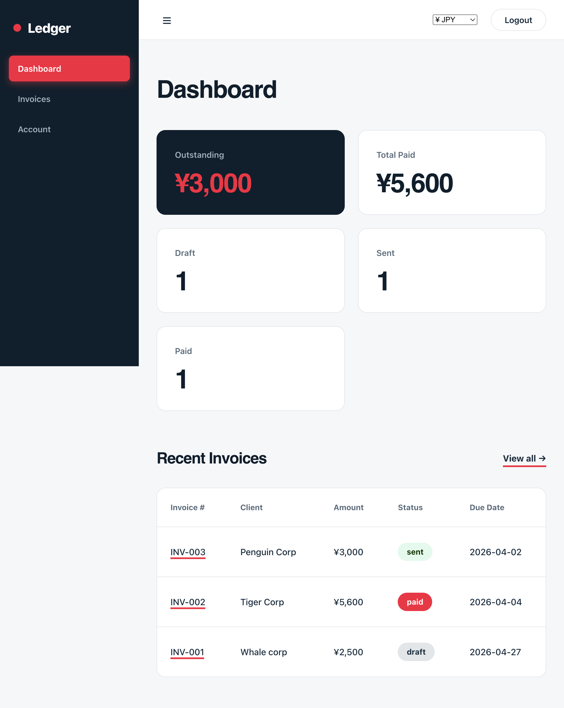
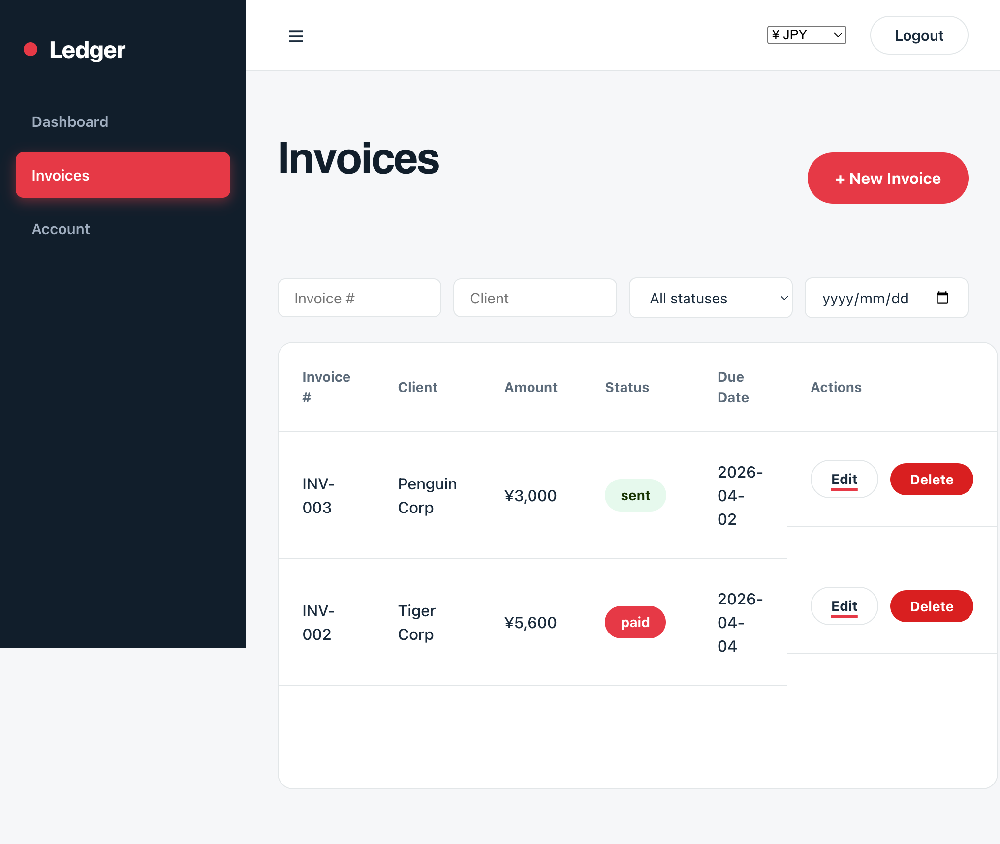

# Ledger — Invoice Management App

A single-user invoice management app. Django REST API backend, React + TypeScript frontend.

## Screenshots






---

## Tech Stack

- **Backend**: Python 3.10+, Django 4.2, Django REST Framework, SimpleJWT, django-axes, django-csp, Whitenoise, SQLite
- **Frontend**: React 18, TypeScript, Vite, React Router 6, Axios

---

## Setup

### Prerequisites

- Python 3.10+
- Node.js 18+

---

### Backend

```bash
cd backend

# Create and activate virtual environment
python -m venv venv
source venv/bin/activate      # macOS/Linux
# venv\Scripts\activate       # Windows

# Install dependencies
pip install -r requirements.txt

# Configure environment variables
cp .env.example .env
# Edit .env and set DJANGO_SECRET_KEY to a real value:
#   python -c "import secrets; print(secrets.token_urlsafe(50))"

# Run migrations
python manage.py migrate

# Seed test user + sample invoices
python manage.py seed
# Credentials are written to backend/seed_credentials.txt — delete it after noting the password

# Start the dev server
python manage.py runserver
```

API available at `http://localhost:8000`

---

### Frontend

```bash
cd frontend

npm install
npm run dev
```

App available at `http://localhost:5173`

---

## Login credentials

The seed command generates a random password and writes it to `backend/seed_credentials.txt`. Open that file for the username and password, then delete it.

---

## API Reference

Authentication uses **HttpOnly cookies**. The login endpoint sets `access_token` and `refresh_token` cookies; all subsequent requests send them automatically. There is no `Authorization` header.

| Method | Endpoint               | Description                        | Auth required |
|--------|------------------------|------------------------------------|---------------|
| POST   | `/api/auth/login/`     | Log in, sets auth cookies          | No            |
| POST   | `/api/auth/refresh/`   | Rotate access token via cookie     | No            |
| POST   | `/api/auth/logout/`    | Blacklist refresh token, clear cookies | Yes       |
| GET    | `/api/auth/verify/`    | Check if current session is valid  | Yes           |
| GET    | `/api/invoices/`       | List invoices for the current user | Yes           |
| POST   | `/api/invoices/`       | Create invoice                     | Yes           |
| GET    | `/api/invoices/:id/`   | Get invoice by ID                  | Yes           |
| PUT    | `/api/invoices/:id/`   | Update invoice                     | Yes           |
| DELETE | `/api/invoices/:id/`   | Delete invoice                     | Yes           |
| GET    | `/api/dashboard/`      | Dashboard summary                  | Yes           |

### Invoice object

```json
{
  "id": 1,
  "client_name": "Acme Corp",
  "invoice_number": "INV-001",
  "line_items": [
    { "description": "Web design", "amount": 1500 },
    { "description": "Hosting setup", "amount": 200 }
  ],
  "due_date": "2024-02-15",
  "status": "sent",
  "created_at": "2024-01-10T12:00:00Z",
  "total_amount": 1700.0
}
```

Status values: `draft` | `sent` | `paid`

Line items: max 100 per invoice, `amount` max 999,999,999.

### Dashboard response

```json
{
  "total_outstanding": 3200.00,
  "total_paid": 5000.00,
  "counts": { "draft": 2, "sent": 3, "paid": 8 },
  "recent_invoices": [ ... ]
}
```

---

## Project Structure

```
ledger/
├── backend/
│   ├── ledger/              # Django project settings & URLs
│   ├── invoices/            # App: models, views, serializers, URLs
│   │   ├── authentication.py    # CookieJWTAuthentication
│   │   └── management/
│   │       └── commands/
│   │           └── seed.py  # Creates test user + sample data
│   ├── manage.py
│   ├── requirements.txt
│   └── .env.example
│
├── frontend/
│   └── src/
│       ├── api/             # axios instance + per-resource API functions
│       ├── components/      # Layout, PrivateRoute, InvoiceForm
│       ├── context/         # AuthContext, CurrencyContext
│       ├── pages/           # Login, Dashboard, Invoices, New, Edit
│       ├── styles/          # global.css
│       ├── types/           # TypeScript interfaces
│       ├── App.tsx          # Router + route definitions
│       └── main.tsx
│
└── README.md
```
