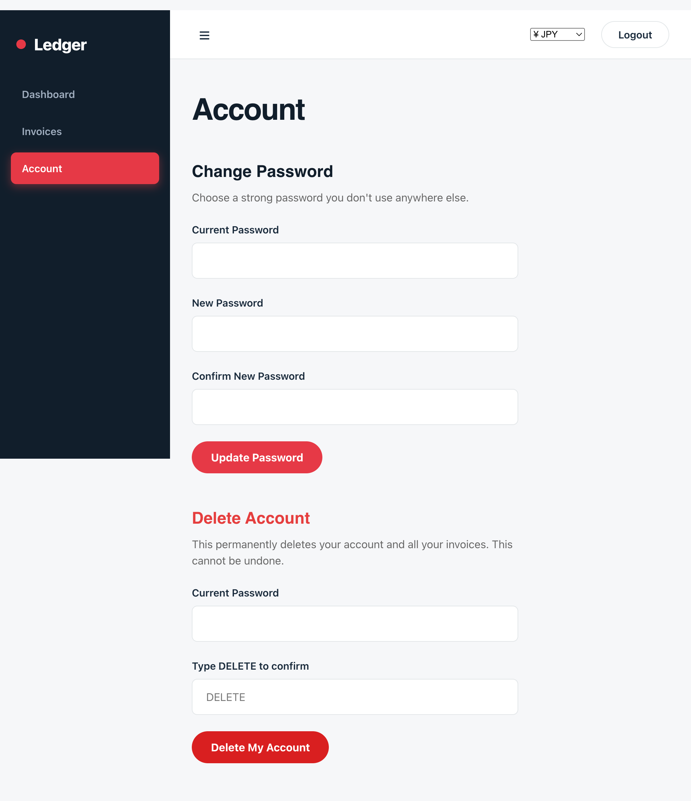

# Ledger

A clean invoice management app built with Django and React.

## Features

- Create, edit, and delete invoices with line items
- Track invoice status — draft, sent, or paid
- Search and filter invoices by number, client, status, or due date
- Dashboard with outstanding and paid totals
- Secure authentication with HttpOnly JWT cookies
- Account management — change password, delete account

## Screenshots

## Stack

**Backend** — Python, Django, Django REST Framework, SimpleJWT

**Frontend** — React, TypeScript, Vite
